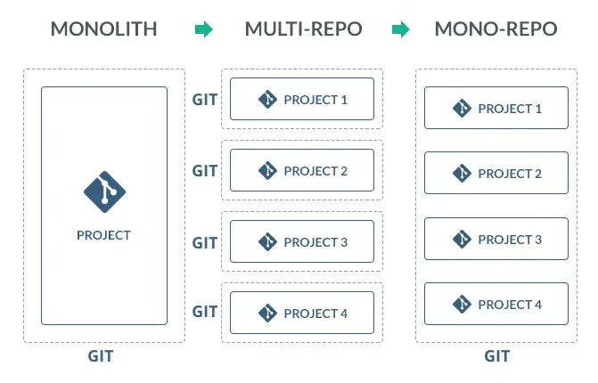

# Nx intro
### Olaf Krawczyk

09.03.2023

---
# Agenda
1. Monorepo
2. Nx - komu to potrzebne?
3. Współdzielenie kodu
4. Scaffolding kodu
5. Łatwiejszy lokalny development 
6. Automatyczna aktualizacja zależności
7. Szybszy CI
8. Minusy Nx

---
# 1. Monorepo

--- 

# 1. Monorepo
### Dlaczego nie multi-repo?
- trudniej współdzielić kod,
- skomplikowane przełączenie pomiędzy projektami,
- wiele `package.json`,
---

## 2. Nx - komu to potrzebne?

- kilka aplikacji w projekcie,
- częste kopiowanie kodu,
- wspólne TS, ESLint, Prettier,
- nowe aplikacje,
  
---

## 3. Współdzielenie kodu

- główny katalog
- globalny `package.json`,
- globalne konfiguracje TS, ESLint, Prettier, etc.
- podział *apps* i *libs*,

##### *integrated repo*

---
# 4. Scaffolding kodu
- generowanie boilerplate aplikacji i komponentów
- Next, Angular, Jest, TS, Express... 
- np. Next - Components, Pages, App
- ponad 100 pluginów 

---

# 5. Łatwiejszy lokalny development 

- `nx run-many --target=[lint|serve|build]`
- caching wyników build, test etc.
- szybszy od `docker-compose`

---

# 6. Automatyczna aktualizacja zależności

- `nx migrate latest` - aktualizacja `nx` i wspieranych zależności
- `nx migrate --run-migrations` - automatycznie aktualizuje kod

---

# 7. Szybszy CI
  
- `nx affected:[build | test | lint]`
- NxCloud
  - lepszy caching 
  - distributed task execution

---

# 8. Minusy Nx
- krzywa uczenia
- kolejne narzędzie w projekcie
- zależność od pluginów Nx 
- NxCloud kosztuje 💸 (500h w miesiącu za darmo)
- relatywne importy, aliasy tylko dla Nx 

---
# Talk is cheap 🤑